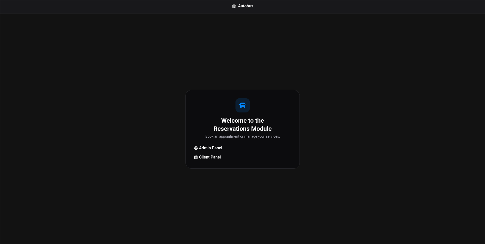
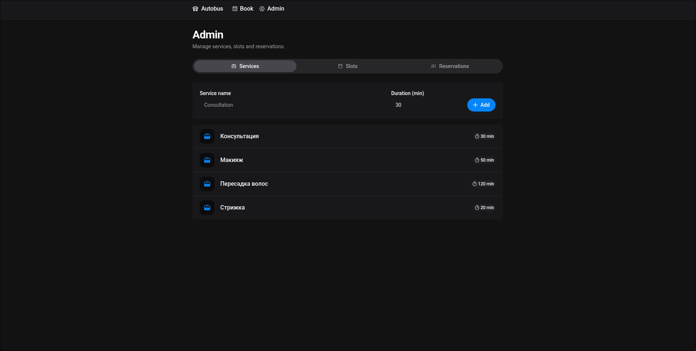
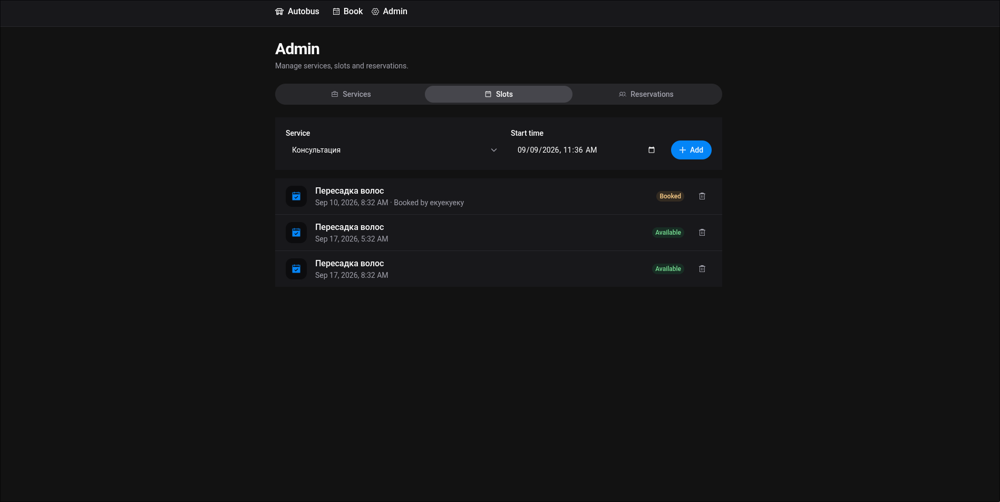
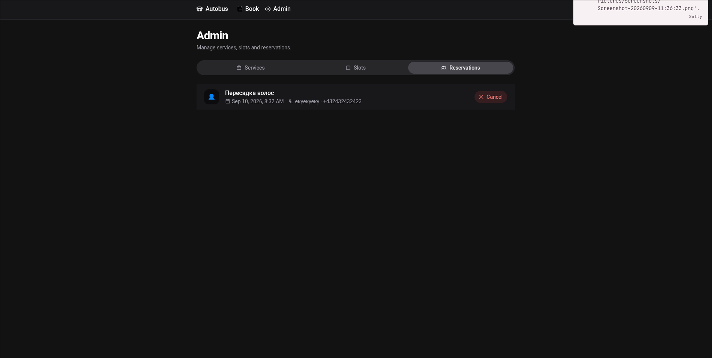
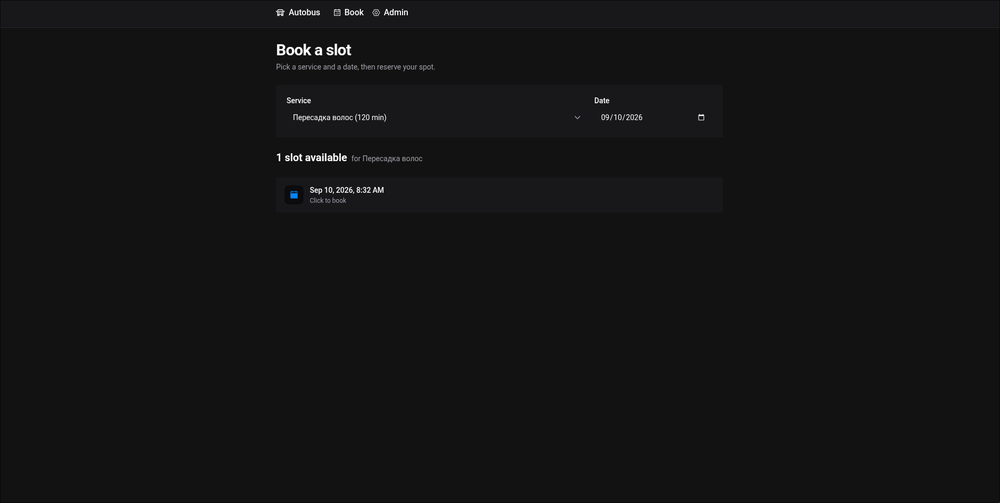

# Autobus — сервис записи (резервирование слотов)
[Лист решений](DECISIONS.md)
## Скриншоты

 
 
 
 
 

## Запуск

### Вариант 1 — Docker Compose (рекомендуется)

Из корня репозитория:

- Для Docker:
```bash
docker compose up
```

- Для Podman (мой вариант):
```bash
podman compose up
```

Сервисы поднимутся на портах:

| Сервис            | Адрес                          |
|-------------------|--------------------------------|
| Frontend (SPA)    | http://localhost:8000          |
| Backend (API)     | http://localhost:8080          |
| Scalar / OpenAPI  | http://localhost:8080/docs     |
| MySQL             | localhost:3306                 |

Миграции применяются автоматически при старте backend (`runner.MigrateUp()`).

### Вариант 2 — локальная разработка

Требуется установленный `.NET 10 SDK`, `Node.js 20+` (pnpm) и работающий MySQL 8.4.

1. Поднимите только MySQL (или любой MySQL 8.4 со строкой из п. «Конфигурация»):

   ```bash
   docker compose up -d mysql
   ```

2. Backend (порт 8080):

   ```bash
   cd ReservationBackend
   dotnet run
   ```

3. Frontend (порт 8000, dev-сервер Vite с hot-reload):

   ```bash
   cd frontend
   pnpm install
   pnpm dev
   ```

4. Откройте http://localhost:8000.

## Конфигурация

### Строка подключения к БД и переменная конфигурации

Backend читает строку подключения из секции `ConnectionStrings` файлов
`appsettings.json` / `appsettings.Development.json`:

```jsonc
// appsettings.Development.json
{
  "ConnectionStrings": {
    "DefaultConnection": "Server=localhost;Port=3306;Database=reservation_db;Uid=reservation;Pwd=reservation;Allow User Variables=true;DateTimeKind=Utc"
  }
}
```
---
Или 

В переменных окружения (например, в `compose.yaml`) просто поменяйте переменную:

```
ConnectionStrings__DefaultConnection
```

Порядок приоритета при получении строки (см. `Program.cs`):

1. Аргумент командной строки `-c <conn>` / `--connection <conn>` (ключ
   конфигурации `CLIConnectionString`);
2. `ConnectionStrings:DefaultConnection` из конфигурации (appsettings / env).

## Реализованные сценарии

### Админ (`/admin`)

- **Услуги**: создание услуги (название + длительность в минутах), список.
- **Слоты**:
  - создание слота (услуга + время начала) с проверкой «не в прошлом»;
  - защита от дубликатов (уникальный индекс `ServiceId + SlotStartTime` → `409`);
  - список с информацией о брони;
  - удаление слота; удаление запрещено (`409`), если на слот уже есть бронь.
- **Брони**: список всех броней, отмена брони (слот снова становится свободным).

### Клиент (`/`)

- Выбор услуги и даты.
- Показ доступных (незабронированных) слотов на выбранную дату.
- Бронирование слота (имя + телефон с валидацией и автоформатированием
  номера, по умолчанию Беларусь `+375`).
- Защита от «двойного бронирования» (`409` при гонке).
- Нельзя забронировать слот, время которого уже наступило.

## Тесты

```bash
cd ReservationBackend.Test
# Для интеграционного теста требуется контейнерный рантайм (Testcontainers
# поднимает MySQL). По умолчанию ожидается Docker.
# Если Docker недоступен — укажите строку подключения к существующему MySQL:
#   TEST_MYSQL_CONNECTION_STRING="Server=localhost;Port=3306;Database=reservation_test;Uid=...;Pwd=...;DateTimeKind=Utc"
dotnet test
```

### Интеграционный тест с podman (вместо Docker)

Testcontainers ищет Docker-сокет. Для podman укажите `DOCKER_HOST` на сокет
podman перед запуском:

```bash
# rootless podman (обычный пользователь):
export DOCKER_HOST="unix:///run/user/$(id -u)/podman/podman.sock"

# rootful podman:
# export DOCKER_HOST="unix:///run/podman/podman.sock"

cd ReservationBackend.Test
dotnet test
```

Если podman-сокет не включён, создайте его:

```bash
systemctl --user enable --now podman.socket
export DOCKER_HOST="unix:///run/user/$(id -u)/podman/podman.sock"
```

Проверка, что сокет доступен:

```bash
curl --unix-socket "$XDG_RUNTIME_DIR/podman/podman.sock" \
  http://localhost/_ping   # ожидается: OK
```

Ограничение: под rootless podman Testcontainers поднимает контейнер, но не
всегда может пробросить порт на хост — если тест не находит MySQL, используйте
`TEST_MYSQL_CONNECTION_STRING` (см. выше) с уже запущенной БД.

## Масштабирование (что изменить при росте нагрузки)

- Текущее решение уверенно справляется с нагрузкой в ~1000 rps на большинстве запросов.
- **~10 000 rps**: разделить чтение и запись (реплики MySQL, read-through кэш), шардировать слоты по услугам/датам; 
Оптимизировать логирование (то, что используется в проекте - базовый вариант для использования Serilog, который вероятно берет слишком много времени на себя, а так это вполне чистый бэк.

## Известные ограничения

1. **Нет пагинации** — списки услуг, слотов и броней возвращаются целиком.
   При большом количестве данных потребуется постраничная выдача.

2. **`Domain/`-модели** (`Service`, `Slot`, `Reservation`) - используются как справочные модели, а не как
   полноценный слой домена с бизнес-правилами.

3. **Валидация номера телефона** — только базовые проверки.